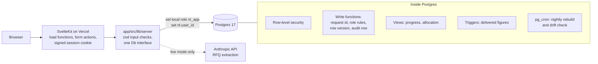

# Northline

A full-stack sales and operations app for Northline Exhaust Co., an invented
maker of heavy-duty truck exhaust parts whose ERP can only export files.
SvelteKit 2 and Svelte 5 with TypeScript, on Postgres 17 (Supabase), with the
business rules enforced inside the database. All data is invented.

**Live demo:** https://sp-demo-one.vercel.app (pick any user on the sign-in page; there are no passwords)

## What it shows

| Workflow | What happens | Start reading at |
|---|---|---|
| Commitments that measure themselves | A buyer's promise (these parts, this window, this value) tracks itself against the invoice ledger. Status is derived, never typed. When a window closes short, the owner answers one question. | [`docs/sql.md`](docs/sql.md), `db/migrations/0003`, `0007`, `0008` |
| RFQ intake | A pasted customer email becomes a draft quote. An extractor proposes; deterministic code validates every field against the catalog and customer master; a person approves; the database creates the quote and a commitment. Scored against a set of test emails. | `app/src/lib/server/rfq/`, [`evals/rfq/`](evals/rfq/) |
| Daily ERP export | The morning "open sales lines" CSV is parsed, normalized, hashed and staged. Suspicious files are held for a person. Applying it allocates stock oldest ship date first and sorts every open line into one bucket. | `app/src/lib/server/exports/`, `db/migrations/0010` |
| Automation setup | A visual when / if / then builder. A rule names a reviewed trigger, adds conditions on its typed fields, and adds a next step or a note. It is tested in a read-only transaction before it is saved, runs daily, and fires at most once per record. | `app/src/lib/automation/catalog.ts`, `app/src/lib/server/automation/` |
| Late-order forecast | Stock and incoming purchase and production orders are handed out over time, so every open line gets a projected ship date, a reason and who to call. | `db/migrations/0016`, [`docs/supply-forecast.md`](docs/supply-forecast.md) |
| Records worth opening | Accounts with their people and history, parts with stock, sales and margin, vendors with terms and contacts, and one search box over all three. | `app/src/routes/accounts/`, `parts/`, `vendors/` |
| Access control | Every request runs as a login-less role with the user's id set; row-level security and checked write functions decide the rest. | `db/migrations/0001`, `app/src/lib/server/db/` |

## Measured

On the full world (4,490 customers, 11,422 parts, 114,555 invoices,
450,522 invoice lines, 2,644 commitments), Supabase Micro compute:

| Commitment board query | Time |
|---|---|
| First version (recursive view) | 10,963 ms |
| Family walk as a function that declares its size | 337 ms |
| Delivered kept current by triggers | 22 ms |
| Today's date read once per query | 6 to 10 ms |

At four times the data (1.8 million invoice lines) the board takes 117 ms,
where recounting every commitment takes 7.96 s. The plans, the trigger
design and the load test are in [`docs/sql.md`](docs/sql.md).

## How it fits together



- No ORM. The SQL is the point; every query is a tagged template with bound parameters.
- Without `DATABASE_URL` the app runs on PGlite, real Postgres compiled to WebAssembly, built from the same migrations. The tests use it too, so they run against Postgres with no setup.
- The AI never writes. It proposes; code validates; a person approves; a database function does the write under that person's name.

## Run it

Node 24.

```bash
cd app
npm install
npm run dev
```

Open http://localhost:5180. The first start builds a local database with a
mid-sized world (a minute or two). No keys or database are needed; RFQ intake
uses its rule-based extractor until a key is configured.

```bash
npm run check      # svelte-check and TypeScript
npm test           # Vitest, database tests on PGlite
npm run build      # production build (Vercel adapter)
npm run eval:rfq   # score RFQ extraction against the test emails
```

To run against Supabase, copy `app/.env.example` to `app/.env` and set
`DATABASE_URL` to the transaction pooler (port 6543). Applying the schema is
described in [`db/README.md`](db/README.md).

## Where things are

| Path | What it is |
|---|---|
| `app/` | The SvelteKit app. Pages in `src/routes`, server code in `src/lib/server`, components in `src/lib/components`. |
| `db/migrations/` | The schema, in order. The only source of truth. `*.supabase.sql` files use Supabase-only features. |
| `db/seed.sql` | The world generator: `nl.reset()`, `nl.build('full' \| 'demo' \| 'small')`. |
| `db/bench/` | The load test. |
| `docs/` | How the SQL works ([`sql.md`](docs/sql.md)). |
| `evals/rfq/` | Test emails, expected results and scored reports for RFQ intake. |
| `fixtures/exports/` | Sample ERP export files, good and bad. |
| [`DECISIONS.md`](DECISIONS.md) | Each real design choice, the options and why. |
| [`CLAUDE.md`](CLAUDE.md) | The rules coding agents follow in this repo. |
| `demo/`, `tools/` | Earlier demo tooling, not part of the app ([`demo/README.md`](demo/README.md)). |

## How this was built

I'm Owen Schoeniger. I designed Northline and directed its build over a few
days: the architecture, the data model, the rules the database enforces, the
validation approach and every decision in `DECISIONS.md`. Most of the code
was written by coding agents (Claude Code) working to those rules, and I
reviewed, tested and measured what they produced. The world's statistical
shape was tuned to match a real business of this kind; no names, records or
exact figures were carried over. Nothing here runs in production or serves
real customers.
